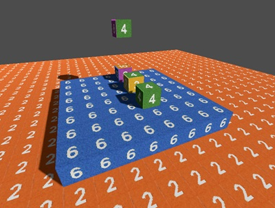

# Easy-Voxels-GDExtension

an easy voxelengine c++ GDExtension for godot 4.5 - not for huge projects, but for quick and easy.        
it uses 16x16x16 chunks and face culling. there are voxels with a single texture or multitexture voxels.    
the tileset is 32x32 + 1 pixel padding (leave 1 pixel seam around every texture) = 34x34.    
the gdextension creates a new Node VoxelEngine.    
for build with scons copy godot-cpp version 4.5 into directory godot-cpp    
for use of the binaries put into bin-directory.     

      
picture from test:        



you can use it for example in gdscript:    
```
  # instantiate class VoxelEngine
  var ve = VoxelEngine.new()
	
  # initialize VoxelEngine sizex, sizey, sizez, tilemap with padding, parentnode, camera3D
  ve.InitVE(64, 32, 64, ResourceLoader.load("res://resources/textures/tilemap32.png"), self, get_node("Camera3D"))

  # set some voxels
  ve.set_voxel_singletexture(Vector3i(14, 2, 16), 4)
  ve.set_voxel_multitexture(Vector3i(16, 2, 16), 2, 3, 4, 5, 6, 7)

  ve.update_world()
```

# the methods with parameters:    
InitVE "size_x", "size_y", "size_z", "tex", "parentnode"        
set_voxel_singletexture "global_pos", "textureid"    
set_voxel_multitexture "global_pos",  "right", "left", "up", "down", "forward", "back"    
update_world   
refresh_world    
delete_voxel "global_pos"    
get_voxel_type "global_pos"    
get_voxel_texture "global_pos", "nr"    
identify_voxel (with this you get the result of the voxel under the mouse in vector3i)    

fill_voxel_region "start", "end", "voxel_type", "texture_id", "multi_texture_ids"         
	example:    
 ```
# fill region SingleTextureVoxel
var start = Vector3i(0, 0, 0)
var end = Vector3i(5, 5, 5)
voxel_engine.fill_voxel_region(start, end, 1, 1) # with textureid 1    

# fill region MultiTextureVoxel
var multi_textures = PackedByteArray([1, 2, 3, 4, 5, 6]) # textures right, left, up, down, forward, back
voxel_engine.fill_voxel_region(start, end, 2, 0, multi_textures)     
```
  

# changes:
v0.2: changed identify_voxel in voxelengine.cpp and added a test in demo/src/node3d.gd    
v0.3: changed voxels from "normal" array to std::unordered_map, new function fill_voxel_region     
v0.4.1: in mode1: texture16-bug is gone. texture-seams half gone...    
v0.4.2: new command refresh_world(), sphere_singletexture   
v0.4.3: removed marchingcubesmode    


